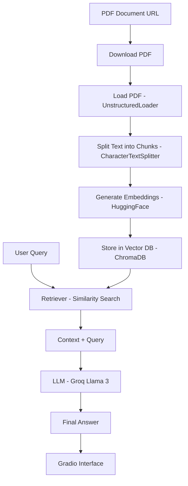

- https://colab.research.google.com/drive/1FpthEZ6-w_NlIJcbeN92XgyqSi7dEaTW#scrollTo=5mB-u-DSMBb0

# RAG System with LangChain, ChromaDB, and Groq

This project implements a Retrieval-Augmented Generation (RAG) system that allows users to ask questions about a PDF document. It uses LangChain for orchestration, ChromaDB as the vector store, HuggingFace for embeddings, and Groq (Llama 3) for the language model.

## Flow Diagram

## Detailed Process Flow

1.  **Environment Setup**: Install necessary libraries (langchain, chromadb, groq, etc.) and configure API keys.
2.  **Document Acquisition**: Download the target PDF document from a provided URL.
3.  **Document Loading**: Use `UnstructuredFileLoader` to extract text from the PDF.
4.  **Chunking**: Split the loaded document into smaller, manageable chunks using `CharacterTextSplitter` to fit LLM context windows and improve retrieval accuracy.
5.  **Embeddings**: Initialize `HuggingFaceEmbeddings` to convert text chunks into numerical vectors.
6.  **Vector Store**: Create and persist a `Chroma` database to store the embeddings for efficient similarity search.
7.  **RAG Chain Setup**:
    *   Initialize the **Retriever** from the vector store.
    *   Setup the **Groq LLM** (Llama 3).
    *   Create a `RetrievalQA` chain to handle the retrieval and generation logic.
8.  **Interactive Interface**: Use **Gradio** to provide a user-friendly web interface for querying the document.

## How to Run
1. Open `rag.ipynb` in Google Colab or a local Jupyter environment.
2. Ensure you have a Groq API Key.
3. Run the cells sequentially to setup the system and launch the Gradio interface.
